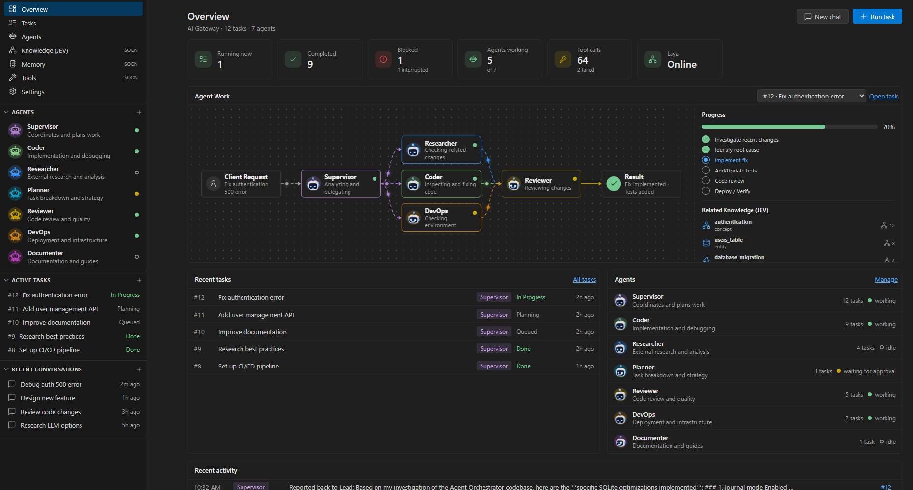
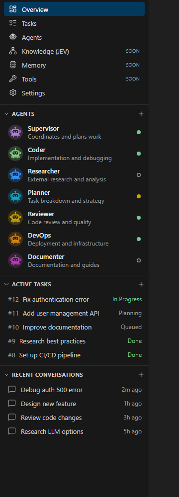
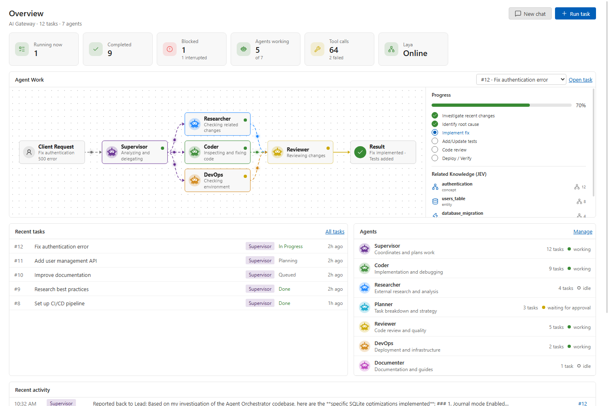
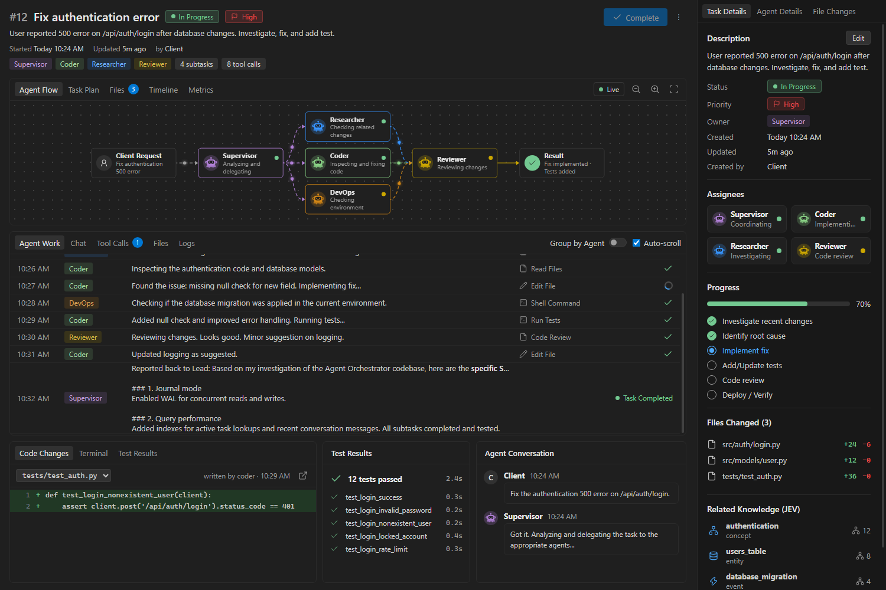
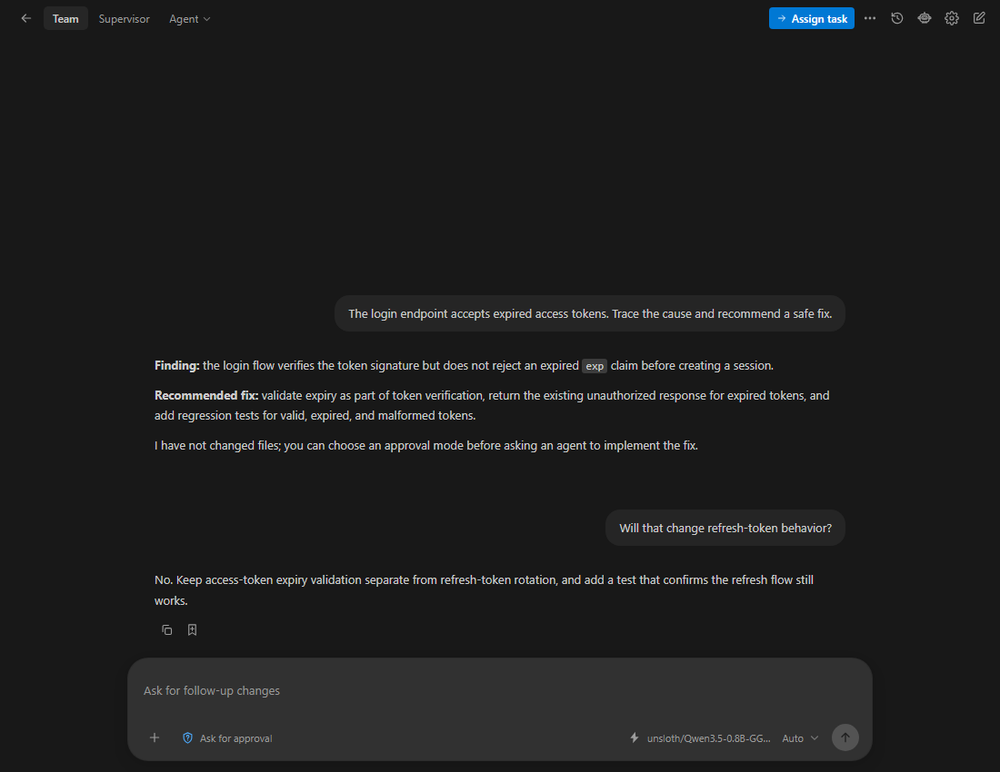

# Agent Orchestration Studio

Coordinate AI agents from VS Code. Give the lead agent a task, let it involve specialists, and review their progress in the task and overview panels.

Agent Orchestration Studio connects to the model providers and agent runtimes you configure. It includes local task tracking and persistent memory, with optional Laya routing, embeddings, and external tools.

## Features

- **Team chat and task execution** — use the `@orchestrator` chat participant, the Agentic chat view, or the Run Task command.
- **Specialist agents** — start with Lead, Coder, Researcher, Planner, Database, Reviewer, DevOps, and Documenter. Edit agents, assign different providers or runtimes, and control whether each can delegate.
- **Delegation and plans** — break larger requests into dependent or parallel tasks, follow hand-offs, and inspect task status and results.
- **Provider choice** — configure OpenAI-compatible or Anthropic model connections and choose a model globally or per agent.
- **Tool controls** — agents can use workspace tools and, when enabled, tools exposed by VS Code such as MCP tools. Tool access is filtered for each agent.
- **Approval modes** — choose whether workspace writes and persistent memory updates ask first, are approved automatically, or use Full access.
- **Persistent memory** — keep conversation summaries and episodic or semantic memories in a local SQLite database. JEV records entities and relations; optional vector search can improve memory matching when an embeddings model is configured.
- **Optional routing with Laya** — use a Laya SystemOne endpoint to help select agents, tools, and context. Disable it or use the rules fallback when Laya is unavailable.
- **External agent runtimes** — connect configured agents to Claude Code, Codex, or a custom CLI; an n8n webhook; or a persistent WebSocket agent service.
- **Progress and history** — inspect active work, tool activity, task results, related knowledge, and recent conversations in the sidebar and panels.

## Screenshots

Example screens with demonstration workspace data.

### Full screen with sidebar



### Sidebar



### Overview panel



### Task workflow



### Agent chat



## Requirements

- Visual Studio Code **1.104.0 or later**.
- A model provider endpoint and model to generate agent responses. Laya, embeddings, MCP tools, and external agent runtimes are optional.

## Get started

1. Install Agent Orchestration Studio, then open **Preferences: Open User Settings (JSON)** from the Command Palette.
2. Paste these settings inside the existing outer `{ }`. Replace the URL and model with values from your provider:

```jsonc
"agentOrchestrator.providers": [
  {
    "id": "main",
    "name": "My Provider",
    "protocol": "openai",
    "baseUrl": "https://YOUR_PROVIDER_URL/v1",
    "model": "YOUR_MODEL_ID",
    "models": ["YOUR_MODEL_ID"]
  }
],
"agentOrchestrator.activeProviderId": "main",
"agentOrchestrator.activeModel": "YOUR_MODEL_ID"
```

3. Run **Agent Orchestration Studio: Configure Provider API Key**, select **My Provider**, and enter your API key. It is stored in VS Code Secret Storage; you do not need to paste it into the settings file.
4. Run **Agent Orchestration Studio: Open Agentic** and send a prompt.

For an Anthropic-compatible provider, set `protocol` to `anthropic`. For a local OpenAI-compatible server, use its API URL for `baseUrl`. The extension does not supply a model or API service.

## Optional Laya routing

Set `agentOrchestrator.layaEndpoint` to your Laya SystemOne endpoint, then run **Agent Orchestration Studio: Configure Laya API Key** and **Agent Orchestration Studio: Test Laya Connection**. Laya helps route requests and decide whether to retrieve memory, graph knowledge, or tools. Agent Orchestration Studio can use its configured fallback when Laya is disabled or unreachable.

## Tools and approvals

The chat approval selector has three modes:

| Mode | Behavior |
| --- | --- |
| **Ask** | Prompt before workspace writes and persistent memory changes. |
| **Approve for me** | Allow those workspace-scoped changes automatically. |
| **Full access** | Also make shell commands available with the current user's permissions. |

External VS Code tools can be enabled or disabled with `agentOrchestrator.externalTools.enabled`. Use `agentOrchestrator.externalTools.toolPatterns`, `agentOrchestrator.externalTools.agentTools`, and `agentOrchestrator.externalTools.autoApprove` to control which external tools agents can see and which may run without an approval prompt. Review tool permissions and approval mode before assigning work.

## Memory and privacy

Conversation history, tasks, traces, memories, and knowledge graph data are stored in a SQLite database in VS Code's global storage for the extension. Embedding search is off by default. API keys and integration tokens configured through the extension's commands are kept in VS Code Secret Storage.

When an agent runs, the request and relevant context are sent to the model provider assigned to that agent. If enabled or configured, requests may also go to Laya, an embeddings endpoint, an external VS Code tool, an n8n workflow, a WebSocket agent, or a coding-agent CLI. Review those services' own data policies before use.

## Configure external agents

Use **Agent Orchestration Studio: Manage Agents** to assign a runtime to an agent. Configure connections in `agentOrchestrator.cliAgents`, `agentOrchestrator.n8nLinks`, or `agentOrchestrator.socketLinks`. Store n8n and WebSocket tokens with **Configure n8n Token** and **Configure Socket Token**.

For WebSocket agents, the extension connects to `wss://` endpoints (or `ws://localhost`) and sends a JSON message with `type: "agent.execute"`, a `requestId`, task details, the agent, and the instruction. The service should answer with `type: "agent.result"` and the same `requestId` plus an `output` string, or `type: "agent.error"` and an `error` message. It may send `agent.progress` messages while working. A configured bearer token is included in the request's `auth.bearerToken` field.

## Commands

Open the Command Palette and search for **Agent Orchestration Studio**.

| Command | Purpose |
| --- | --- |
| **Open** | Open the `@orchestrator` VS Code chat participant. |
| **Open Agentic** | Open the Agentic chat view. |
| **Run Task** | Start a task from a prompt. |
| **Manage Agents** | Create or edit agents and their provider/runtime assignments. |
| **Open Overview** | View extension status and recent work. |
| **Open Latest Task** | Reopen the most recent task panel. |
| **Configure Provider API Key** | Store or remove a provider key. |
| **Configure Laya API Key / Test Laya Connection** | Configure and check the optional Laya service. |
| **Show External Tools (MCP)** | Review external VS Code tools visible to the extension. |

## Troubleshooting

- **No model response:** check the provider URL, protocol, model name, saved key, and network access.
- **Laya is unconfigured:** set `agentOrchestrator.layaEndpoint` and use **Test Laya Connection**, or turn Laya off to use the fallback behavior.
- **An external tool is missing:** check that the tool is registered in VS Code and matches the external tool settings and agent grants.
- **A CLI agent is unavailable:** install its CLI and ensure VS Code can find it on `PATH`.

## Contributing

Contributions are welcome. See [CONTRIBUTING.md](CONTRIBUTING.md) for the development setup and pull request checklist. Please report bugs and request features through the repository's GitHub Issues page.

## License

This project is licensed under the [MIT License](LICENSE).
